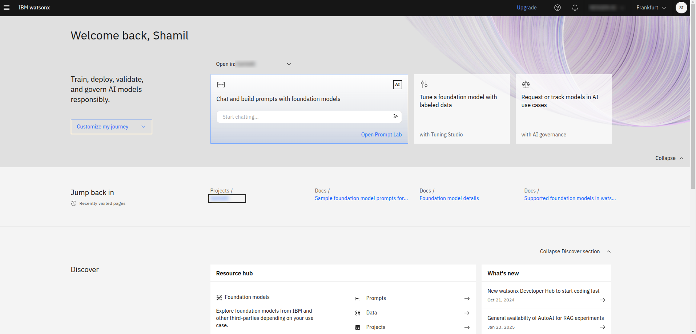
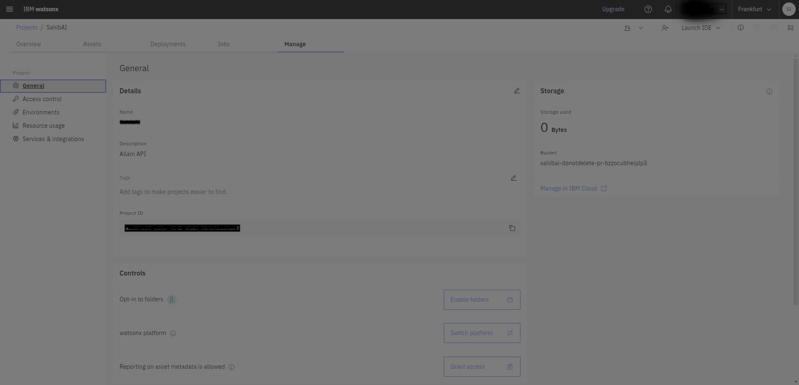
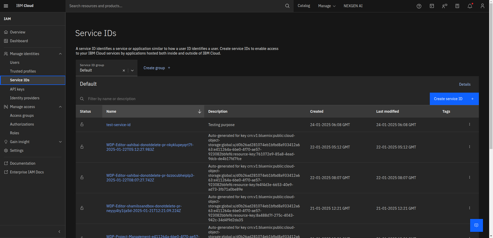
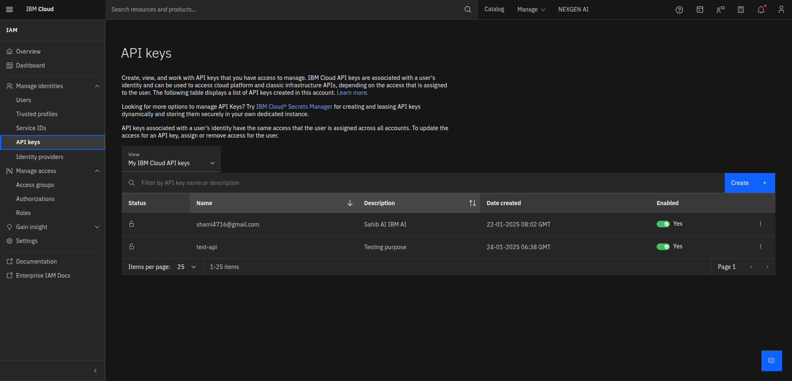

---
date:
    created: 2025-01-24
    updated: 2025-02-17
categories:
  - Tech
  - LLM
tags:
  - Technology
authors:
  - sumanth
---

This blog will walk you through how to access language models on IBM Wastonx.ai platform and use them for inference.


<!-- more -->

### Getting Project ID

After logging into your IBM cloud account, navigate to [watsonx.ai](https://watsonx.ai). You'll be welcomed with the following screen:


In the top left corner, you'll find the menu button. Choose "Projects", create a new project, and give it a name. 
Next, go to the "Manage" section and select "General". Copy the Project ID and store it somewhere safe, as we will later use it in the API calls.



### Creating Service ID and API Token

You need to create Service ID and add it as a collaborator for your newly created project.

First, go to the "Access (IAM)". Under "Manage Identities" section, select "Service IDs".



Create a Service ID, give it a name and add a description to it, so when you comeback you know what you've created it for.

Next, under the  same section [Manage Identities], select "API Keys" and create an API key. This key will be used to generate a bearer token for our API call.
Give the key a name and description, create the key and store it somewhere safe, as it won't be accessible later.


We are done with the IAM section. Now we need to associate the Service ID with the new project we've created. 

Go to the "Manage" section of your project and add collaborators. And under "Add Collaborators" section, select "Add Service IDs". You'll be presented with a blank screen, you need to search for your Service ID name in the search bar.



Add the ID and give it a role you desire. I've given "Admin" role.

### Getting the Access Token

To use the API we need an Access Token. You can get it using a curl command or from other supported languages. You can find the documentation in the following [link](https://cloud.ibm.com/docs/account?topic=account-iamtoken_from_apikey#iamtoken_from_apikey)

But for your reference I'll provide the curl command below
```
curl -X POST 'https://iam.cloud.ibm.com/identity/token' -H 'Content-Type: application/x-www-form-urlencoded' -d 'grant_type=urn:ibm:params:oauth:grant-type:apikey&apikey=MY_APIKEY'
```

You need to paste the API key we've copied before in the above command and run it, we will get something like this.

```
{
"access_token":"eyJraWQiOiIyIklCTWlkLTY5NjAwMFA5WFIiLCJuYW1lIjoiU2hhbWlsIElxYmFsIiwiZ2l2ZW5fbmFtZSI6IlNoYW1pbCIsImZhbWlseV9uYW1lIjoiSXFiYWwiLCJlbWFpbCI6InNoYW1pNDcxNkBnbWFpbC5jb20ifSwiYWNjb3VudCI6eyJ2YWxpZCI6dHJ1ZSwiYnNzIjoiZDBiMjZhZDI4MTA3NGViMWJmYmQ4YTkzMzQxMmE2NjMiLCJmcm96ZW4iOnRydWV9LCJpYXQiOjE3Mzc3MDA4OTksImV4cCI6MTczNzcwNDQ5OSwiaXNzIjoiaHR0cHM6Ly9pYW0uY2xvdWQuaWJtLmNvbS9pZGVudGl0eSIsIm",
"refresh_token":"not_supported",
"token_type":"Bearer",
"expires_in":3600,
"expiration":1737704499,
"scope":"ibm openid"
}
```

For Safety purpose I've removed some part of my access  token. Yours will be bigger. Copy the whole thing somewhere, we will be using this to in our API calls.

### API for the Language Model

First you need to get the Endpoint URL. You can find it in the following [link](https://cloud.ibm.com/apidocs/watsonx-ai)
You need to choose URL of the region you want to use the service from. I'm going with the Frankfurt endpoint. `https://eu-de.ml.cloud.ibm.com`

Next we will get the Inference API from the following [link](https://cloud.ibm.com/apidocs/watsonx-ai#text-generation).
```
curl --request POST 'https://{cluster_url}/ml/v1/text/generation?version=2023-05-02'
-H 'Authorization: Bearer <Your Generated Bearer Token>'
-H 'Content-Type: application/json'
-H 'Accept: application/json'
--data-raw '{
  "input": "<s> [INST]Translate the following text from English to Arabic. Use \"END\" at the end of the translation. \nEnglish \nTomatoes are one of the most popular plants for vegetable gardens. \nEND",
  "parameters": {
    "decoding_method": "greedy",
    "max_new_tokens": 900,
    "min_new_tokens": 0,
    "stop_sequences": [],
    "repetition_penalty": 1
  },
  "model_id": "sdaia/allam-1-13b-instruct",
  "project_id": "<Your Project ID>"
}'
```

You can find the list of models you want in the following [link](https://eu-de.dataplatform.cloud.ibm.com/docs/content/wsj/analyze-data/fm-models.html?context=wx&audience=wdp#third-party-provided). You need to replace it in the `model_id` key.  Also, replace the `cluster_url` with the endpoint we've copied before. Replace all the values between "<  >" with your values.
That's it. Now you can use it for the inference.
**If the bearer token expires, regenerate it again and use it.**

## FINI